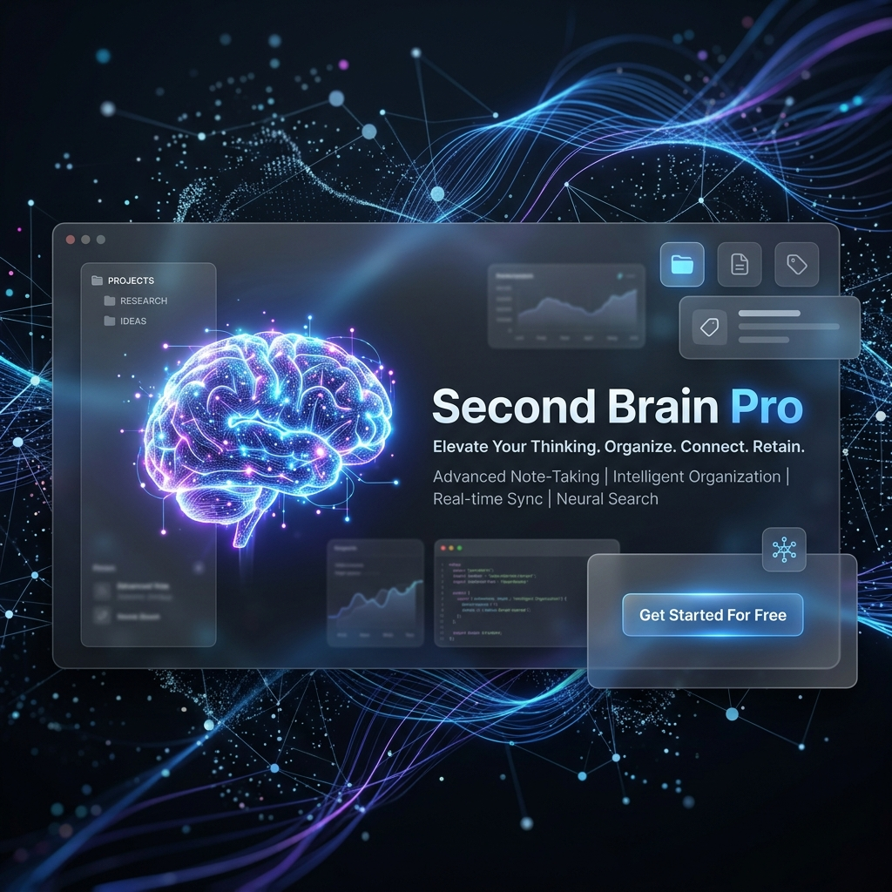

# 🧠 Second Brain Pro



**Second Brain Pro** is a premium, private note-taking ecosystem designed for high-performance individuals. Combining AI-powered summarization with a focus-driven UI, it helps you capture ideas, organize thoughts, and maintain peak productivity.

---

## 🌐 Live Deployment

The project is fully deployed and ready to use:

- **Frontend:** Hosted on [Vercel](https://second-brain-pro-app.vercel.app) (Optimized Static Hosting)
- **Backend:** Hosted on [Render](https://second-brain-pro.onrender.com) (Node.js & OpenRouter Integration)
- **API Status:** Live at `https://second-brain-pro.onrender.com/health`

---

## ✨ Key Features

### 📊 Intelligent Dashboard
- **Total Stats:** Real-time note count and tag distribution insights.
- **Today's Focus:** Smart filtering for your daily priorities.
- **Weekly Report:** Advanced productivity tracking and completion rates.

### 🤖 AI-Powered Insights
- **Smart Summarization:** Generate concise summaries using the **OpenRouter API**.
- **Deep Analysis:** Extracts focus areas and actionable next steps from your notes.
- **Node.js Engine:** Robust backend processing for seamless AI interactions.

### 🧘‍♂️ Immersive Focus Mode
- **Glassmorphism UI:** A distraction-free reading environment.
- **Pomodoro Timer:** Built-in productivity timer with custom durations.
- **Haptic Feedback:** Visual and auditory cues for work/break cycles.

### 🔗 Smart Connections
- **Contextual Linking:** Automatically discovers related notes based on content analysis.
- **Daily Journaling:** Dedicated reflections space for long-term growth.

---

## 🛠️ Tech Stack


---

## 🚀 Getting Started

### Prerequisites
- **Node.js** (v16+)
- **OpenRouter API Key** (for AI features)

### Local Setup

1. **Clone the repository**
   ```bash
   git clone https://github.com/sahiljayant19/second-brain-pro.git
   cd second-brain-pro
   ```

2. **Install dependencies**
   ```bash
   npm install
   ```

3. **Configure Environment Variables**
   Create a `.env` file in the `/backend` directory:
   ```env
   PORT=8000
   OPENROUTER_API_KEY=your_openrouter_api_key_here
   ```

4. **Launch the Engine**
   ```bash
   npm start # Starts the backend server
   ```

5. **Open the App**
   Serve `index.html` via Live Server or simply open it in your browser.

---

## 🔐 Privacy & Security

- **Local-First:** Your notes are stored exclusively in your browser's `LocalStorage`.
- **Zero Tracking:** No analytics, no cookies, no data collection.
- **Secure API:** Summaries are processed securely via OpenRouter with no data retention.

---

## 🤝 Contributing

Contributions are what make the open-source community such an amazing place to learn, inspire, and create. Any contributions you make are **greatly appreciated**.

1. Fork the Project
2. Create your Feature Branch (`git checkout -b feature/AmazingFeature`)
3. Commit your Changes (`git commit -m 'Add some AmazingFeature'`)
4. Push to the Branch (`git push origin feature/AmazingFeature`)
5. Open a Pull Request

---

*Engineered with ❤️ for the productivity-obsessed.*